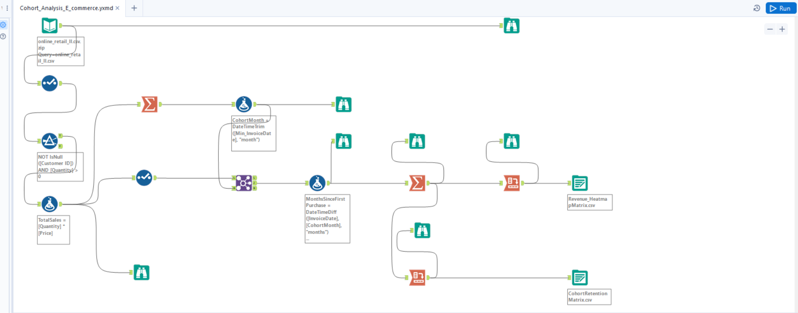

# E-commerce Customer Cohort Analysis with Alteryx

 A Complete cohort analysis workflow using Alteryx Designer, transforming raw e-commerce transaction data into a retention matrix ready for visualization in Tableau or Power BI.

## 🚀 Project Highlights

- **Business Problem:** Understand customer retention patterns and revenue trends over time for an e-commerce business.
- **Tools Used:** Alteryx Designer (workflow automation, data transformation), CSV export (for BI visualization).
- **Key Steps:**
  - Data cleaning and preparation
  - Calculating TotalSales per transaction
  - Assigning CohortMonth to each customer
  - Joining cohort info to all transactions
  - Calculating MonthsSinceFirstPurchase
  - Summarizing into a retention matrix
  - Exporting results for visualization

## 📊 Workflow Overview

- The workflow is modular, well-annotated, and ready for extension (e.g., in Power BI/Tableau dashboards).

## 💡 Why This Project?

- Automate complex data transformations in Alteryx
- Prepare data for advanced analytics and visualization
- Document and share reproducible analytics workflows

## 🛠️ How to Use

1. Open the `.yxmd` file in Alteryx Designer.
2. Run the workflow with your own e-commerce data (or the provided sample).
3. Export the retention matrix as CSV for visualization in Tableau or Power BI.

## 📈 Next Steps

- Add Tableau/Power BI dashboards for interactive cohort analysis.
- Extend the workflow for revenue cohort analysis or customer segmentation.

---

